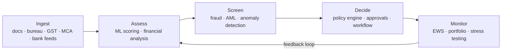
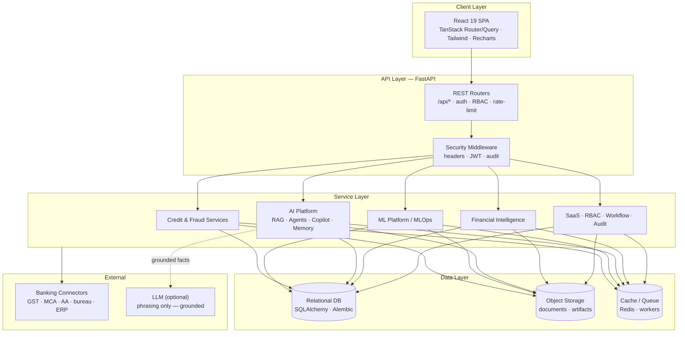
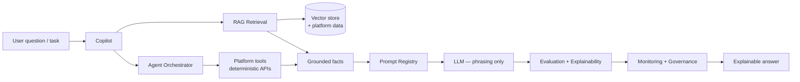
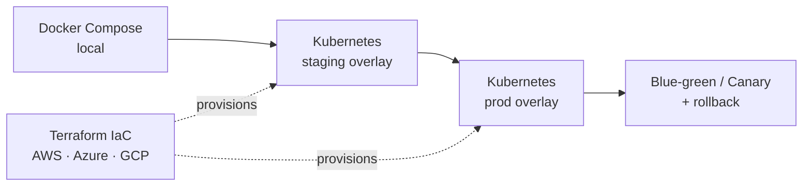

<div align="center">

#  AI Credit Intelligence Platform

### The AI-native operating system for enterprise credit, risk & lending

_Assess creditworthiness, detect fraud, and make explainable lending decisions at bank scale — in seconds, not weeks._

<br/>

[](https://www.python.org/)
[](https://fastapi.tiangolo.com/)
[](https://react.dev/)
[](https://www.typescriptlang.org/)
[](https://tanstack.com/)

[](docs/ai/index.md)
[](docs/ml/index.md)
[](docs/product/index.md)
[](docs/deployment/index.md)

[](.github/workflows/ci.yml)
[](docs/testing/index.md)
[](CHANGELOG.md)
[](LICENSE)

<br/>

**[Documentation](docs/index.md)** ·
**[Architecture](docs/architecture/index.md)** ·
**[Quick Start](#-quick-start)** ·
**[API Overview](#-api-overview)** ·
**[Roadmap](docs/product/ROADMAP.md)** ·
**[Changelog](CHANGELOG.md)**

</div>

<br/>

> [!NOTE]
> **Hero image placeholder** — replace with a product screenshot or platform banner.
>
> <p align="center"></p>
>
> _Suggested asset: the Executive Command Center dashboard (`/api/ai/command-center`), 16:9, 1600×900._

---

## Table of Contents

- [Executive Summary](#-executive-summary)
- [Platform Overview](#-platform-overview)
- [Core Modules](#-core-modules)
- [Architecture](#-architecture)
- [Technology Stack](#-technology-stack)
- [Repository Structure](#-repository-structure)
- [Installation](#-installation)
- [Quick Start](#-quick-start)
- [Screenshots](#-screenshots)
- [API Overview](#-api-overview)
- [AI Architecture](#-ai-architecture)
- [Enterprise Architecture](#-enterprise-architecture)
- [Development Workflow](#-development-workflow)
- [Testing](#-testing)
- [Security](#-security)
- [Performance](#-performance)
- [Deployment](#-deployment)
- [Roadmap](#-roadmap)
- [Contributing](#-contributing)
- [License](#-license)
- [Acknowledgements](#-acknowledgements)

---

## Executive Summary

Credit decisions still move at the speed of paperwork. Analysts stitch together
bureau pulls, bank statements, GST filings and spreadsheets by hand; fraud is
caught after the money is gone; and when a regulator asks *"why was this loan
approved?"* the answer is a shrug.

**The AI Credit Intelligence Platform** is a full-stack, AI-native decisioning
system that closes that gap. It ingests financial and alternative data, scores
creditworthiness with machine learning, screens for fraud in real time, and
returns an **explainable, auditable decision** — wrapped in a multi-tenant SaaS
control plane with RBAC, workflow, approvals, and bank-grade security.

| | |
|---|---|
| **What problem does it solve?** | Slow, manual, opaque, non-scalable credit and fraud decisioning. |
| **Who is it for?** | Banks, NBFCs, fintechs, credit funds, enterprise lenders and government credit institutions. |
| **Why is it different?** | Every number is computed deterministically from platform data; the LLM layer *explains* facts, it never invents them. Fully explainable, fully auditable, additive by design. |
| **What is the outcome?** | Second-scale decisions, continuous portfolio monitoring, early-warning risk signals, and a defensible audit trail for every action. |

> [!TIP]
> **Grounded AI, by construction.** The Copilot, agents and narrative reports are
> grounded in deterministic platform data. The optional LLM only phrases facts —
> it never fabricates numbers, scores or ratings.

---

## Platform Overview

The platform is a **credit decision operating system**. It spans the full lending
lifecycle — from a raw document to a monitored, risk-rated position on the book.

<div align="center">



</div>

**Pitched to the institution:**

| Segment | What the platform delivers |
|---------|----------------------------|
| **Banks** | End-to-end underwriting, Basel III / IFRS 9 analytics, portfolio & treasury intelligence, regulator-ready audit. |
| **NBFCs** | Fast alternative-data underwriting, automated document intelligence, real-time fraud screening. |
| **Fintechs** | API-first credit-as-a-service, multi-tenant SaaS, developer platform, embeddable decisioning. |
| **Credit funds** | Portfolio optimization, RAROC, concentration & stress analysis, scenario simulation. |
| **Enterprise lenders** | Configurable workflow, RBAC, approvals, SLA monitoring, plugin marketplace. |
| **Government institutions** | Explainable, auditable decisioning; compliance dashboards; data-residency-aware deployment. |

---

## Core Modules

The platform is organized as **additive capability layers**, each fully backward
compatible. Every module exposes REST APIs, a dedicated UI surface, RBAC
permissions and its own tests.

### Credit & Risk Core

| Module | Purpose | Key capabilities | Business value |
|--------|---------|------------------|----------------|
| **Enterprise Credit Assessment** | Underwrite borrowers end-to-end | Multi-factor scoring, risk banding, approval recommendation, confidence scoring | Consistent, second-scale underwriting |
| **OCR & Document Intelligence** | Turn documents into structured data | Extraction, classification, validation of financial statements & KYC | Removes manual data entry |
| **Financial Analysis** | Analyze financial health | Ratio analysis, spreading, trend detection, cash-flow assessment | Objective financial view |
| **AI Risk Intelligence** | Predict & explain risk | ML risk models, feature attribution, explainability | Transparent, defensible risk |
| **Fraud Detection** | Catch bad actors in real time | Isolation-Forest anomaly detection, suspicious-pattern & velocity screening | Loss prevention |
| **Decision Engine** | Turn signals into decisions | Policy rules, thresholds, override handling | Codified, auditable policy |
| **Portfolio Analysis** | See the book, not just the loan | Segmentation, approval rates, health metrics, concentration | Portfolio-level control |

### AI & ML Platform

| Module | Purpose | Key capabilities | Business value |
|--------|---------|------------------|----------------|
| **ML Platform (MLOps)** | Operate models responsibly | Registry, versioning, drift detection, monitoring, explainability | Governed model lifecycle |
| **AI Agents** | Autonomous analytical workers | Multi-agent orchestration, tool use, investigation flows | Automates analyst busywork |
| **RAG & Enterprise Search** | Grounded retrieval over your data | Vector retrieval, citation-backed answers, semantic search | Answers grounded in your corpus |
| **AI Copilot** | Natural-language analysis | Grounded Q&A, NL→query analytics | Self-serve insight for every user |
| **Prompt Management** | Prompt governance | Registry, versioning, evaluation harness | Reproducible, tested prompts |
| **Knowledge Graph** | Model relationships & exposure | Entities (companies/directors/suppliers/lenders), traversal, risk propagation | Sees hidden connected risk |
| **Scenario Simulation & Digital Twin** | Ask "what if?" | PD/rating/limit re-scoring, stress testing, financial digital twin | Forward-looking risk management |

### Enterprise & Platform

| Module | Purpose | Key capabilities | Business value |
|--------|---------|------------------|----------------|
| **Multi-Tenant SaaS** | Serve many institutions safely | Tenancy, billing, feature flags, quotas, isolation | Cloud-native productization |
| **Workflow & Approvals** | Route work reliably | Configurable pipelines, multi-step approvals, SLAs | Operational control |
| **Monitoring & Observability** | Know what's happening | Metrics, logs, traces, alerting, SLA/cost tracking | Production confidence |
| **Banking Connectors** | Plug into the ecosystem | GST, MCA, Account Aggregator, bureau, ERP, payments, collateral, Customer 360 | Live, integrated data |
| **Policy Engine** | Enforce the rules | Declarative policy, RBAC, guardrails | Compliance by design |
| **Developer Platform & Marketplace** | Extend the platform | API keys, webhooks, sandbox, plugin marketplace, integration studio | Ecosystem & extensibility |
| **Executive Command Center** | Run the business | Real-time dashboards, recommendations, NL analytics | Leadership visibility |

> Full module documentation: **[docs/index.md](docs/index.md)** · AI internals: **[docs/ai/index.md](docs/ai/index.md)** · financial-domain modules: **[docs/product/index.md](docs/product/index.md)**.

---

## Architecture

A layered, additive architecture: a React SPA talks to a FastAPI service layer,
which orchestrates ML, AI, and banking-connector services over a relational
store and object storage, with an optional LLM strictly for phrasing.



| Layer | Responsibility |
|-------|----------------|
| **Frontend** | React 19 SPA — file-based routing, server-state caching, dashboards, command palette. |
| **API** | FastAPI routers with JWT auth, RBAC enforcement, rate limiting, security headers and audit logging. |
| **AI Layer** | RAG, multi-agent orchestration, Copilot, long-term memory, prompt registry, evaluation, explainability, monitoring. |
| **ML Layer** | Credit-risk & fraud models, model registry, drift detection, governance. |
| **Database** | SQLAlchemy models + Alembic migrations (single linear head, reversible). |
| **Storage** | Object storage for documents & artifacts; signed URLs; retention & secure deletion. |
| **Banking Connectors** | Connector framework for GST, MCA, Account Aggregator, bureaus, ERP, payments, collateral, Customer 360. |
| **LLMs** | Optional, gated adapter used **only** to phrase deterministic facts. Offline-safe local default. |
| **Enterprise Modules** | Multi-tenancy, workflow, approvals, marketplace, developer platform, executive center. |

Deep dives: **[System Architecture](docs/architecture/index.md)** · **[AI Architecture](docs/ai/AI_ARCHITECTURE.md)** · **[Database Architecture](docs/architecture/DATABASE_ARCHITECTURE_FINAL.md)**.

---

## Technology Stack

| Domain | Technologies |
|--------|-------------|
| **Frontend** | React 19, TypeScript 5.8, Vite 7, TanStack Router, TanStack Query, Tailwind CSS, Recharts, Framer Motion |
| **Backend** | Python 3.13, FastAPI, SQLAlchemy, Pydantic, Uvicorn, JWT auth |
| **AI** | Retrieval-Augmented Generation, multi-agent orchestration, prompt registry & evaluation, gated LLM adapters (offline-safe local default) |
| **ML** | scikit-learn, Isolation Forest, NumPy, Pandas, model registry & drift monitoring |
| **Database** | SQLAlchemy ORM, Alembic migrations; SQLite (dev) → PostgreSQL (prod) |
| **Cloud** | AWS / Azure / GCP via a multi-cloud Terraform contract |
| **DevOps** | Docker, Docker Compose, Kubernetes (Kustomize overlays), GitHub Actions CI/CD |
| **Security** | JWT rotation, refresh-token reuse detection, MFA (TOTP), AES-256-GCM field encryption, PII masking, RBAC, audit |
| **Deployment** | Docker images (app/worker/scheduler), K8s base + env overlays, blue-green / canary / rollback |
| **Integrations** | GST, MCA, Account Aggregator, credit bureaus, ERP, payments, collateral, Customer 360, open API |
| **Observability** | Prometheus, Grafana, Loki, Tempo, Alertmanager |

---

## Repository Structure

```
ai_credit_system/
├── backend/                     # FastAPI application
│   ├── app/
│   │   ├── core/                # settings, security, crypto, auth, middleware
│   │   ├── db/                  # session, base, engine
│   │   ├── models/              # SQLAlchemy models (33 modules)
│   │   ├── schemas/             # Pydantic request/response schemas
│   │   ├── routes/              # REST routers (37 modules → /api/*)
│   │   ├── services/            # domain logic (24 service packages)
│   │   │   ├── ai_platform/     # RAG, agents, copilot, memory, prompts, eval
│   │   │   ├── financial_intelligence/  # treasury, Basel/IFRS9, ESG, forecasting
│   │   │   ├── banking_os/      # banking operating-system services
│   │   │   ├── enterprise_platform/     # UX, marketplace, developer, ops
│   │   │   ├── ml/  rbac/  audit/  approvals/  workflow/  saas/  ...
│   │   ├── ml/                  # ML models & inference
│   │   ├── workers/             # background jobs & schedulers
│   │   └── main.py              # app factory & router wiring
│   ├── alembic/versions/        # database migrations (single linear head)
│   └── tests/                   # 115 test modules, 1,300+ tests
├── frontend/                    # React 19 SPA
│   └── src/
│       ├── routes/              # file-based routes (102 route files)
│       ├── features/            # feature modules (ai-platform, banking-os, …)
│       ├── components/          # shared UI components
│       ├── hooks/  lib/         # hooks & API client
│       └── server/              # SSR entry
├── deploy/                      # Docker, K8s (base + overlays), Nginx, monitoring
│   ├── k8s/{base,overlays}/     # Kustomize manifests
│   └── monitoring/              # Prometheus, Grafana, Loki, Tempo, Alertmanager
├── infra/terraform/             # multi-cloud IaC (AWS/Azure/GCP), remote state
├── docs/                        # the documentation hub (see docs/index.md)
├── .github/                     # CI/CD workflows, CODEOWNERS, issue/PR templates
├── docker-compose.yml           # local full-stack orchestration
├── Dockerfile                   # multi-stage app/worker/scheduler build
├── CHANGELOG.md · CONTRIBUTING.md · CODE_OF_CONDUCT.md · SECURITY.md · LICENSE
└── README.md                    # you are here
```

---

## Installation

### Prerequisites

- **Python 3.13+**
- **Node/Bun** (frontend uses [Bun](https://bun.sh))
- **Docker** & Docker Compose (for the containerized path)
- **PostgreSQL** (production; SQLite works out of the box for development)

### Backend

```bash
# from repo root
python -m venv .venv && source .venv/bin/activate   # Windows: .venv\Scripts\activate
pip install -r requirements.txt

# apply database migrations
alembic upgrade head

# run the API (http://localhost:8000, docs at /docs)
uvicorn backend.app.main:app --reload
```

### Frontend

```bash
cd frontend
bun install
bun run dev            # http://localhost:5173
```

### Docker (full stack)

```bash
docker compose up --build      # API + worker + scheduler + dependencies
```

### Production

See **[Deployment Guide](docs/deployment/DEPLOYMENT_GUIDE.md)** for Kubernetes
(Kustomize overlays) and **[Terraform IaC](docs/deployment/INFRASTRUCTURE_TERRAFORM.md)**
for the multi-cloud substrate.

### Environment variables

Copy the template and fill in values:

```bash
cp .env.example .env
```

All settings are additive with safe defaults — see **[Configuration](docs/deployment/CONFIGURATION.md)**.

---

## Quick Start

```bash
# 1. Clone
git clone https://github.com/Shriyansh21-ai/ai_credit_system.git
cd ai_credit_system

# 2. Backend
python -m venv .venv && source .venv/bin/activate
pip install -r requirements.txt
cp .env.example .env
alembic upgrade head
uvicorn backend.app.main:app --reload &

# 3. Frontend
cd frontend && bun install && bun run dev

# 4. Open the app
#    UI  → http://localhost:5173
#    API → http://localhost:8000/docs   (interactive OpenAPI)
```

> [!TIP]
> First run? Register a user via `POST /api/auth/signup`, log in to get a JWT,
> then explore the interactive API docs at `/docs`.

---

## Screenshots

> [!NOTE]
> Screenshot placeholders — drop images into `docs/assets/` and update the paths.

| Executive Command Center | Credit Assessment |
|:---:|:---:|
|  |  |
| **Fraud Intelligence** | **Portfolio Analytics** |
|  |  |

---

## API Overview

All endpoints are served under `/api/*` and documented interactively at `/docs`
(OpenAPI). Auth is JWT bearer; access is enforced per-endpoint via RBAC.

| Area | Base path | Highlights |
|------|-----------|------------|
| **Authentication** | `/api/auth/*` | signup, login, refresh, MFA |
| **Credit** | `/api/prediction`, `/api/history`, `/api/portfolio` | scoring, history, portfolio summary |
| **Fraud** | `/api/fraud/*` | detection, history, summary |
| **Documents** | `/api/documents/*` | upload, OCR, extraction |
| **Analysis** | `/api/analysis/*` | financial analysis & spreading |
| **ML Platform** | `/api/ml/*`, `/api/ml_platform/*` | registry, drift, explainability |
| **AI Platform** | `/api/aip/*` | RAG, agents, copilot, prompts, eval |
| **Autonomous Intelligence** | `/api/ai/*` | knowledge graph, EWS, simulation, command center, NLQ |
| **Financial Intelligence** | `/api/fin/*` | treasury, Basel/IFRS9, ESG, forecasting |
| **Banking OS** | `/api/os/*` | banking operating-system services |
| **Enterprise Platform** | `/api/ent/*` | workspaces, marketplace, developer, ops |
| **SaaS** | `/api/saas/*` | tenancy, billing, flags, quotas |
| **Platform** | `/api/rbac`, `/api/audit`, `/api/approvals`, `/api/monitoring` | governance & operations |

Full reference: **[API Reference Guide](docs/api/API_REFERENCE_GUIDE.md)** · platform conventions: **[API Platform](docs/api/API_PLATFORM.md)**.

---

## AI Architecture

The AI layer is **grounded and governed** — it augments deterministic decisioning,
it does not replace it.



| Capability | What it does |
|------------|--------------|
| **RAG** | Retrieval-augmented generation over your corpus and live platform data, with citations. |
| **Agents** | Multi-agent orchestration for investigations and multi-step analysis using deterministic platform tools. |
| **Memory** | Long-term memory for context continuity across sessions. |
| **Prompt Registry** | Versioned, reviewable prompts — reproducible and testable. |
| **Evaluation** | Automated evaluation harness for prompt/model quality. |
| **Explainability** | Feature attribution and rationale behind every prediction. |
| **Monitoring** | Drift, quality and usage monitoring for AI/ML in production. |
| **Model Governance** | Model registry, approvals, and lifecycle controls. |

See **[AI Architecture](docs/ai/AI_ARCHITECTURE.md)**, **[RAG](docs/ai/RAG_ARCHITECTURE.md)**, **[Agents](docs/ai/AGENT_FRAMEWORK.md)**, **[Governance](docs/ai/AI_GOVERNANCE.md)**.

---

## Enterprise Architecture

| Capability | Description |
|------------|-------------|
| **Multi-Tenant** | Tenant isolation, billing, feature flags, quotas — cloud-native SaaS. |
| **RBAC** | Fine-grained, permission-based access control across every module (175+ permissions). |
| **Workflow** | Configurable pipelines with multi-step approvals and SLAs. |
| **Audit** | Immutable audit trail for every sensitive action. |
| **Compliance** | SOC 2 / ISO 27001 / PCI / GDPR / RBI-informed controls & retention. |
| **Zero Trust** | Security Center, risk-based auth, device & IP posture, signed URLs. |
| **Knowledge Graph** | Connected-exposure and relationship intelligence across entities. |
| **Enterprise Search** | Semantic search across platform data and documents. |
| **Executive Dashboards** | Real-time command center, recommendations and NL analytics. |

See **[Enterprise Platform Report](docs/reports/ENTERPRISE_PLATFORM_REPORT.md)**, **[Compliance](docs/security/COMPLIANCE.md)**, **[Security Architecture](docs/security/SECURITY_ARCHITECTURE.md)**.

---

## Development Workflow

```bash
# local development
uvicorn backend.app.main:app --reload         # backend
cd frontend && bun run dev                     # frontend

# testing
pytest backend/tests                           # full backend suite

# formatting & lint
ruff check backend                             # correctness-core gate
ruff format backend                            # format

# database migrations
alembic revision --autogenerate -m "message"   # create
alembic upgrade head                            # apply
alembic downgrade -1                            # revert

# frontend quality
cd frontend && bun run lint && bun run typecheck && bun run build
```

CI runs lint, matrix tests, migration round-trip, security scans and Docker
builds on every PR. See **[CI/CD](docs/deployment/CICD.md)** and
**[Contributing](CONTRIBUTING.md)**.

---

## Testing

- **1,300+ automated tests** across **115 test modules** (`backend/tests/`).
- Run the full suite from the repo root:

```bash
pytest backend/tests
pytest backend/tests -k fraud          # a subset
pytest --cov=backend/app               # with coverage
```

**Philosophy:** every additive layer ships with its own tests; zero-regression
policy across phases and tracks; migrations verified via upgrade→downgrade→
re-upgrade round-trips in CI. See **[Testing](docs/testing/index.md)**.

---

## Security

| Control | Implementation |
|---------|----------------|
| **Authentication** | JWT with key rotation (`kid`), refresh-token rotation + reuse detection, MFA (TOTP). |
| **Authorization** | Fine-grained RBAC enforced per endpoint. |
| **Encryption** | AES-256-GCM field encryption with key rotation & crypto-shredding. |
| **Secrets** | KMS-backed secret containers; **no secrets in the repo** (gitleaks hard gate). |
| **Audit** | Immutable audit log of sensitive actions. |
| **Compliance** | SOC 2 / ISO 27001 / PCI / GDPR / RBI-informed controls. |
| **Rate limiting** | Per-tenant/per-route limiting; account lockout on brute force. |
| **PII** | Masking for logs/exports, retention policies, secure deletion. |

Report a vulnerability responsibly via **[SECURITY.md](SECURITY.md)**. Architecture
details in **[Security Architecture](docs/security/SECURITY_ARCHITECTURE.md)**.

---

## Performance

| Concern | Approach |
|---------|----------|
| **Caching** | Redis-backed caching for hot reads. |
| **Background jobs** | Worker + scheduler processes for async & recurring work. |
| **Scaling** | Stateless API for horizontal scale; K8s HPA-ready. |
| **Observability** | Prometheus metrics, Grafana dashboards, Loki logs, Tempo traces, Alertmanager. |
| **Monitoring** | SLA and cost tracking in the Operations Center. |

See **[Performance](docs/operations/PERFORMANCE.md)**, **[Scaling Guide](docs/deployment/SCALING_GUIDE.md)**, **[Observability](docs/operations/OBSERVABILITY.md)**.

---

## Deployment



| Target | How |
|--------|-----|
| **Docker** | `docker compose up --build` — full stack locally. |
| **Kubernetes** | Kustomize `base` + env `overlays` under `deploy/k8s/`. |
| **Cloud** | Multi-cloud Terraform (`infra/terraform/`) — one `source` line switches cloud. |
| **Production** | Blue-green / canary rollout with automated rollback. |
| **Horizontal scaling** | Stateless API + worker/scheduler; scale replicas independently. |

See **[Deployment](docs/deployment/index.md)** · **[Containers](docs/deployment/CONTAINERS.md)** · **[Go-Live Checklist](docs/deployment/GO_LIVE_CHECKLIST.md)**.

---

## Roadmap

** Completed** — Phases 1–10 and Tracks 1–4 delivered the full platform, reaching
**v1.0.0 Commercial GA**: credit & fraud core, ML/AI platforms, banking connectors,
multi-tenant SaaS, autonomous intelligence, financial intelligence, and enterprise
productization.

** Future & Research** — deeper streaming fraud, expanded regulatory packs,
additional cloud/data-residency options, and continued AI evaluation research.

Full history in the **[Changelog](CHANGELOG.md)**; forward-looking plans in the
**[Roadmap](docs/product/ROADMAP.md)** and **[Roadmap v2](docs/product/ROADMAP_v2.md)**.

---

## Contributing

Contributions follow a professional, additive workflow — Conventional Commits,
DCO sign-off, Code-Owner review and green CI. Existing APIs, migrations and
config are never broken; new capability is added alongside.

Read **[CONTRIBUTING.md](CONTRIBUTING.md)** and the **[Code of Conduct](CODE_OF_CONDUCT.md)**
before opening a PR. New here? Start with **[Onboarding](docs/development/ONBOARDING.md)**.

---

## License

This project is **proprietary and confidential**. Copyright © 2026 Shriyansh Dev.
All rights reserved. See **[LICENSE](LICENSE)**.

---

## Acknowledgements

Built on the shoulders of the open-source community — **FastAPI**, **React**,
**TanStack**, **SQLAlchemy**, **scikit-learn**, **Pydantic**, **Alembic**,
**Tailwind CSS**, **Recharts**, and the broader Python & TypeScript ecosystems.

<div align="center">

---

**AI Credit Intelligence Platform** · built by **[Shriyansh Dev](https://github.com/Shriyansh21-ai)**

_Intelligent, explainable, auditable credit decisioning — at scale._

</div>
