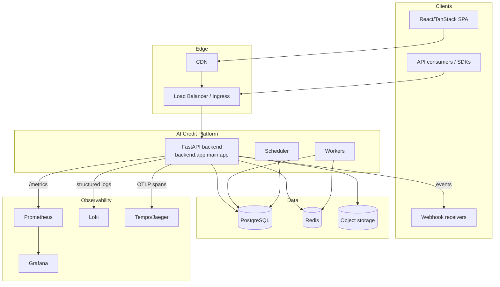
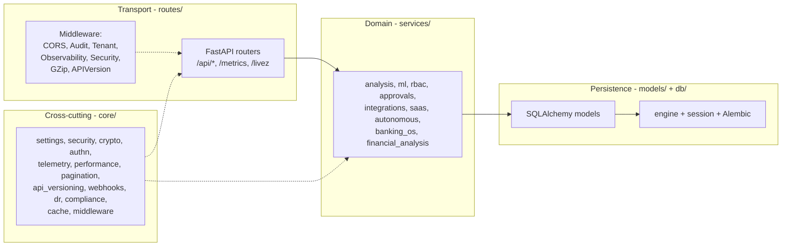
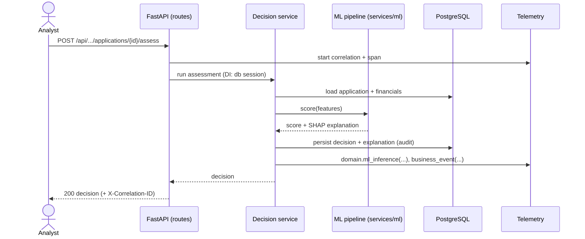

# Architecture

_Phase 11, M13 — architecture overview for the AI Credit Intelligence Platform._

An AI-native, multi-tenant enterprise banking platform: credit intelligence,
decisioning, ML risk models, banking connectors, a SaaS control plane, an
autonomous "AI brain", and a banking OS layer — built additively across Phases
1–11.

---

## 1. System context



## 2. Layered architecture (Clean Architecture / DDD)



Dependencies point inward: transport → domain → persistence. `core/` provides
cross-cutting capabilities to all layers. No layer imports outward.

## 3. Request lifecycle (middleware stack)

Outermost → innermost (response headers applied on the way out):

```
SecurityHeaders → APIVersion → GZip → Observability → Tenant → Audit → CORS → route
```

- **Observability** assigns a correlation id, times the request, records metrics.
- **Tenant** resolves the ambient tenant (multi-tenancy).
- **Audit** records one row per mutating request.
- **Security** stamps OWASP headers; **APIVersion** stamps lifecycle headers.

## 4. Credit decision — sequence



## 5. Modules (backend/app)

| Package | Responsibility |
|---------|----------------|
| `core/` | settings, security/crypto/authn, telemetry, performance, pagination, api_versioning, webhooks, dr, compliance, cache, middleware |
| `routes/` | FastAPI routers (`/api/*`), probes, `/metrics` |
| `services/` | domain logic: analysis, ml, rbac, approvals, integrations, saas, autonomous, banking_os, financial_analysis |
| `models/` | SQLAlchemy ORM models (schema owned by Alembic) |
| `db/` | engine, session factory, `get_db` dependency |
| `ml/` | model artifacts + scoring/explainability |
| `workers/` | background worker + scheduler + healthcheck |
| `schemas/` | Pydantic request/response models |

## 6. Deployment topology

Three container images from one multi-stage `Dockerfile` (`backend`, `worker`,
`scheduler`), orchestrated on Kubernetes (`deploy/k8s`) with per-environment
Kustomize overlays, fronted by nginx + ingress, backed by managed Postgres/Redis/
object storage provisioned by Terraform (`infra/terraform`, AWS/Azure/GCP). See
[DEPLOYMENT.md](DEPLOYMENT.md) and [CONTAINERS.md](CONTAINERS.md).

## 7. Cross-cutting concerns → docs

| Concern | Doc |
|---------|-----|
| Observability / SLOs | [OBSERVABILITY.md](OBSERVABILITY.md) |
| Security | [SECURITY.md](SECURITY.md) |
| Performance | [PERFORMANCE.md](PERFORMANCE.md) |
| API platform | [API_PLATFORM.md](API_PLATFORM.md) |
| Disaster recovery | [DISASTER_RECOVERY.md](DISASTER_RECOVERY.md) |
| Compliance | [COMPLIANCE.md](COMPLIANCE.md) |
| CI/CD | [CICD.md](CICD.md) |
| Configuration | [CONFIGURATION.md](CONFIGURATION.md) |

## 8. Architecture Decision Records

Significant decisions are recorded under [`adr/`](adr/) — start with
[ADR-0001 (monorepo)](adr/0001-monorepo-structure.md) and
[ADR-0002 (two-tier lint)](adr/0002-two-tier-lint-adoption.md).
