# Architecture Diagrams

A visual reference for the AI Credit Intelligence Platform. Every diagram below
renders natively on GitHub (Mermaid). They are grouped into **System**,
**Frontend**, **Backend & Data**, **AI / ML pipelines**, **Security**, and
**Deployment**.

> These diagrams are documentation of the shipped system — the FastAPI backend
> under `backend/app`, the TanStack Start frontend under `frontend/src`, the
> Alembic-managed relational store, and the container/Kubernetes deployment
> assets under `deploy/` and `infra/`.

---

## 1. Overall System Architecture

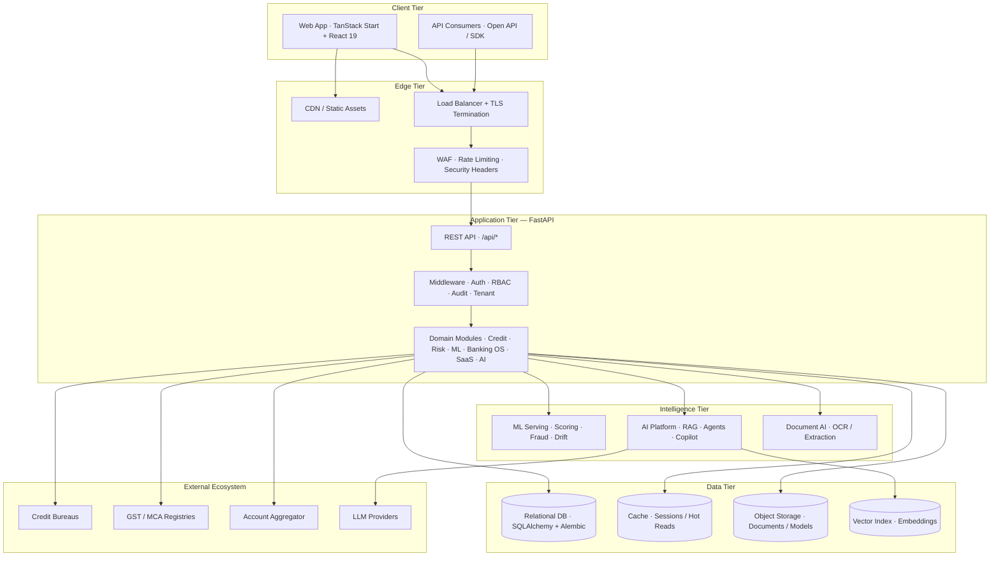

---

## 2. Frontend Architecture

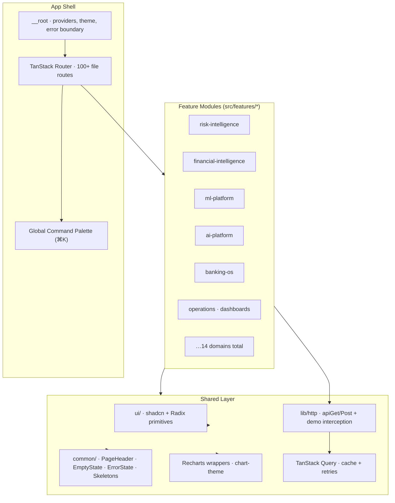

Each route is a thin wrapper that composes primitives from its feature module —
keeping pages consistent and the design system single-sourced.

---

## 3. Backend Architecture (Clean Architecture / DDD)

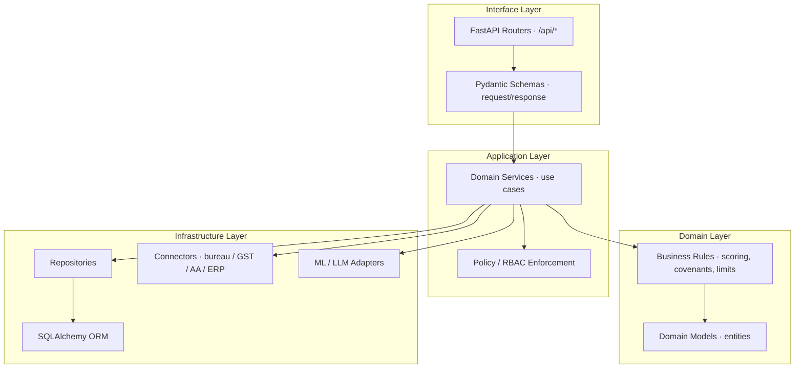

---

## 4. Database Architecture

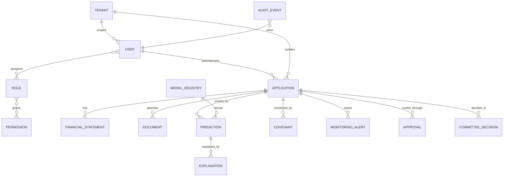

The store is managed exclusively through **Alembic migrations** — the physical
schema is never hand-edited. Multi-tenant tables carry a `tenant_id` scope
enforced at the query layer.

---

## 5. Enterprise Banking Workflow (Credit Decision Lifecycle)

```mermaid
flowchart LR
  Intake["Application Intake"] --> KYC["KYC / KYB + Bureau Pull"]
  KYC --> Docs["Document Ingestion + OCR"]
  Docs --> Spread["Financial Spreading"]
  Spread --> Score["AI Credit Scoring"]
  Score --> Fraud["Fraud / AML Screening"]
  Fraud --> Risk["Risk Rating + Limits"]
  Risk --> Decision{"Auto-Decision?"}
  Decision -- "Within policy" --> AutoApprove["Auto-Approve"]
  Decision -- "Referral" --> Committee["Credit Committee"]
  Committee --> Approve["Approve / Reject / Condition"]
  AutoApprove --> Disburse["Sanction + Disbursal"]
  Approve --> Disburse
  Disburse --> Monitor["Portfolio Monitoring"]
  Monitor --> EWS["Early-Warning Signals"]
  EWS -->|breach| Review["Covenant Review / Remediation"]
  Review --> Monitor
```

---

## 6. AI Pipeline

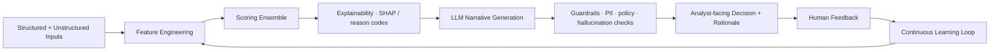

---

## 7. ML Pipeline (MLOps Lifecycle)

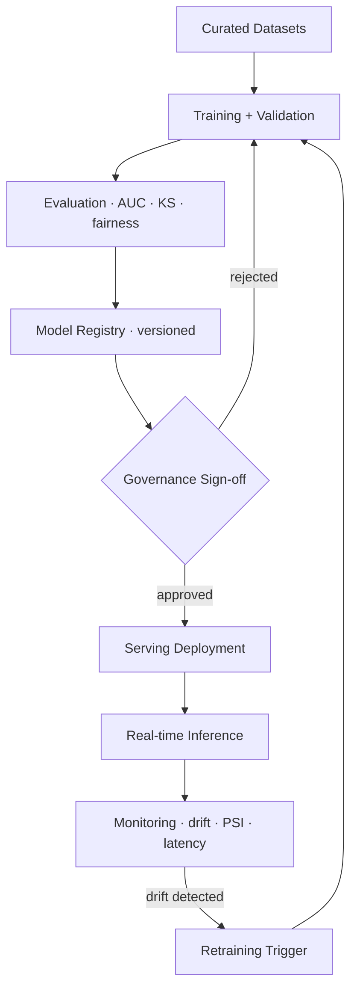

---

## 8. OCR / Document Processing Pipeline

```mermaid
flowchart LR
  Upload["Upload · PDF / image / scan"] --> Classify["Document Classification"]
  Classify --> Preprocess["Preprocess · deskew · denoise"]
  Preprocess --> OCR["OCR · text + layout"]
  OCR --> Extract["Field Extraction · KV + tables"]
  Extract --> Validate["Validation · schema + cross-checks"]
  Validate --> Reconcile["Reconciliation vs declared figures"]
  Reconcile --> Persist["Persist · structured financials"]
  Persist --> Index["Index for Retrieval"]
```

---

## 9. RAG Pipeline

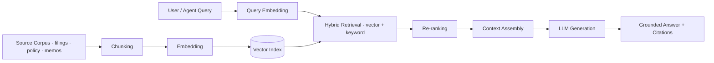

---

## 10. Agent Architecture

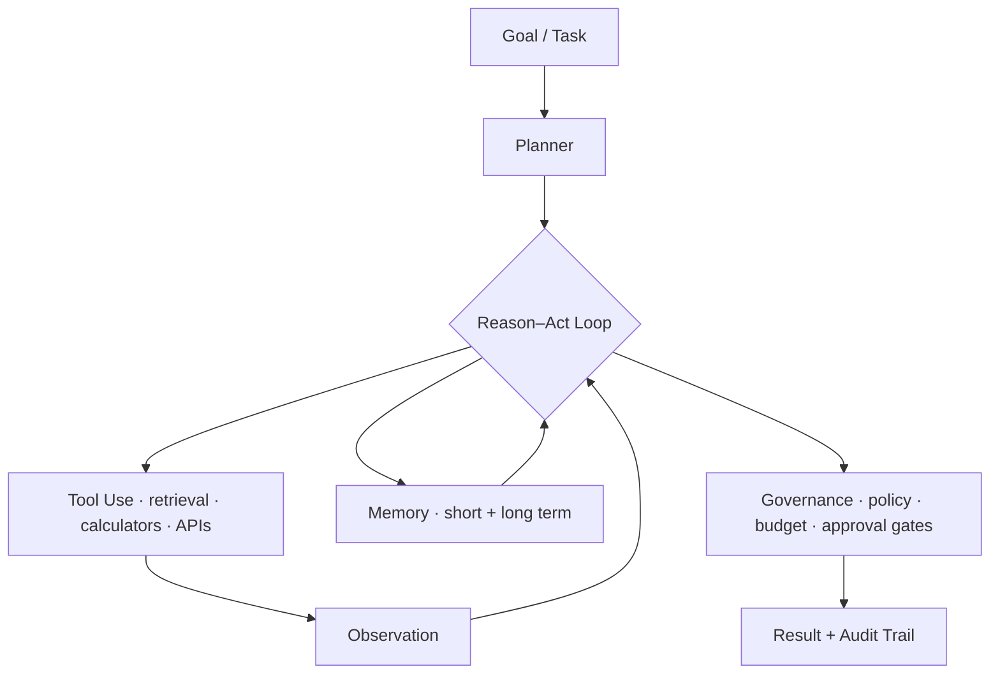

---

## 11. Security Architecture (Defense in Depth)

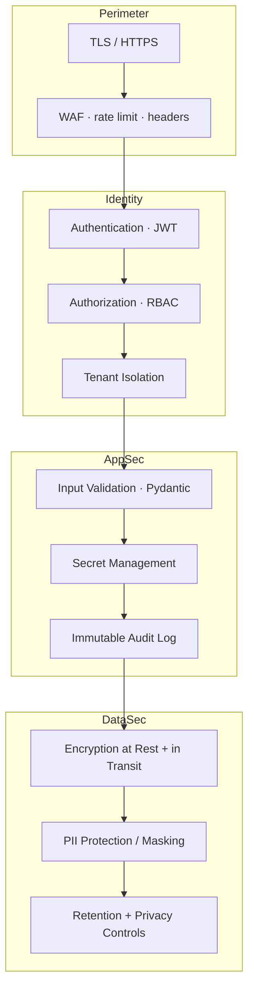

---

## 12. Authentication Flow

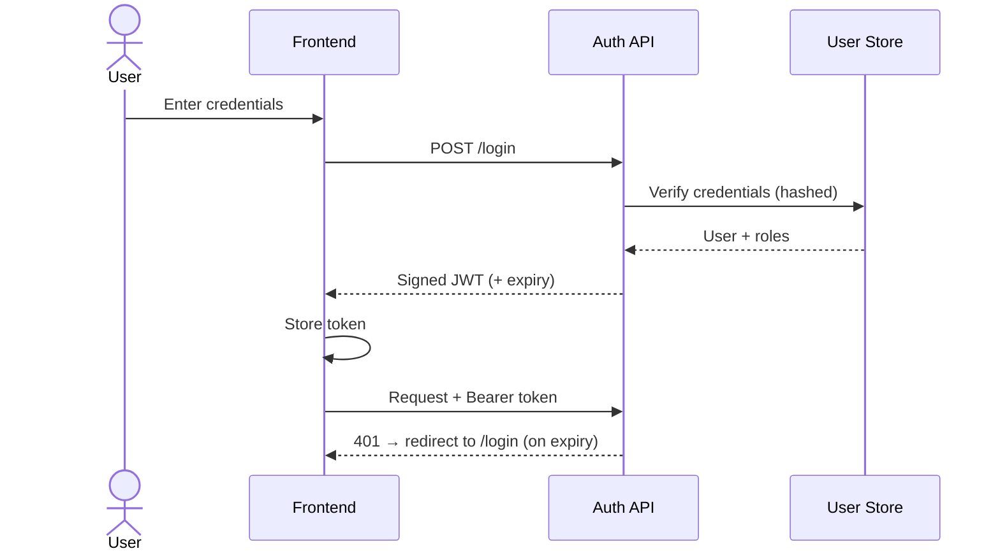

---

## 13. Authorization Flow (RBAC)

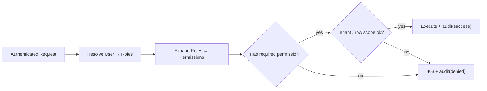

---

## 14. Deployment Architecture

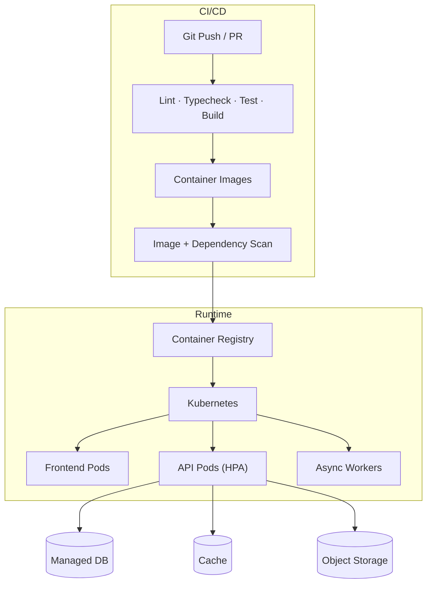

---

## 15. Kubernetes Architecture

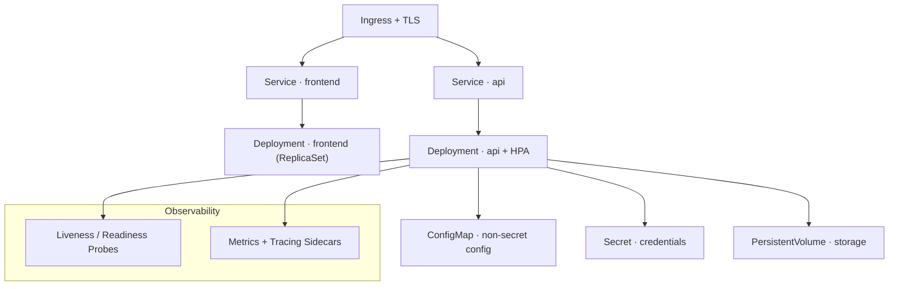

---

## 16. Microservice / Module Interaction

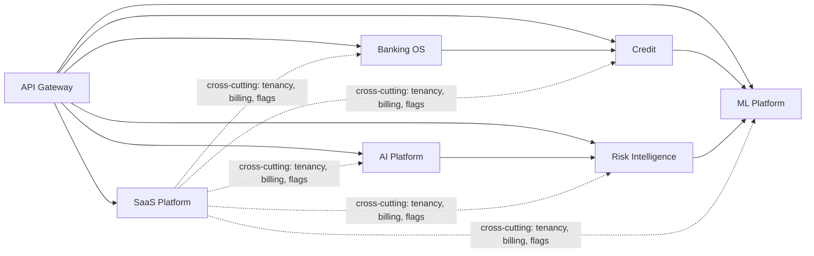

---

## 17. Multi-Tenant Architecture

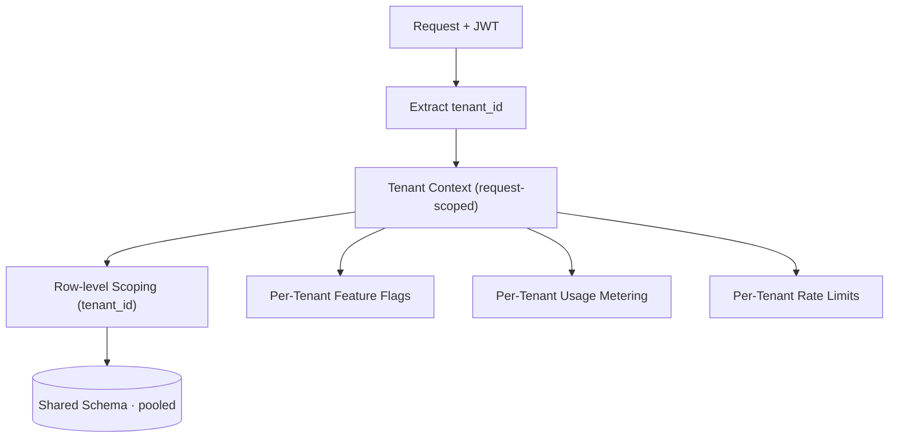

---

## 18. Banking Ecosystem Integration

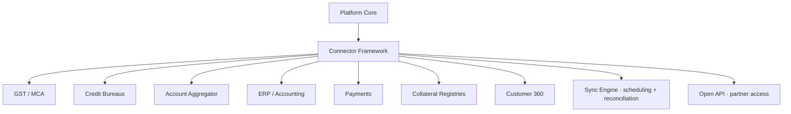

---

## 19. Knowledge Graph

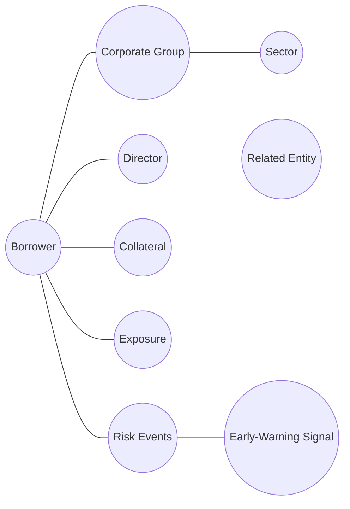

Relationship traversal surfaces hidden concentration, related-party exposure and
contagion paths that flat tables cannot express.

---

## 20. Digital Twin

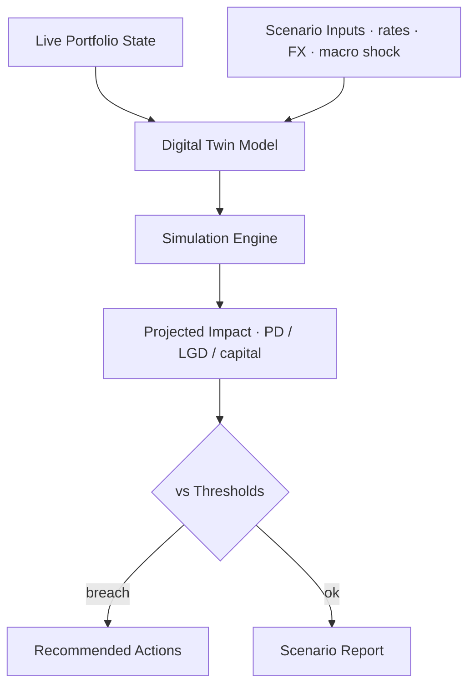

---

## 21. Workflow Engine

```mermaid
stateDiagram-v2
  [*] --> Draft
  Draft --> Submitted: submit
  Submitted --> UnderReview: assign
  UnderReview --> PendingApproval: recommend
  PendingApproval --> Committee: refer
  PendingApproval --> Approved: approve
  Committee --> Approved: approve
  Committee --> Rejected: reject
  UnderReview --> Rejected: reject
  Approved --> Disbursed: disburse
  Disbursed --> Monitoring: activate
  Monitoring --> [*]
  Rejected --> [*]
```

---

## 22. Request Lifecycle (Middleware Stack)

```mermaid
sequenceDiagram
  participant C as Client
  participant MW as Middleware Stack
  participant R as Router
  participant S as Service
  participant D as Data
  C->>MW: HTTP request
  MW->>MW: Security headers · CORS
  MW->>MW: Rate limit
  MW->>MW: Authenticate (JWT)
  MW->>MW: Resolve tenant + RBAC
  MW->>R: Dispatch
  R->>S: Validated command
  S->>D: Read / write
  D-->>S: Result
  S-->>R: Response model
  R-->>MW: Serialize
  MW->>MW: Audit event
  MW-->>C: Response
```

---

_See also: [`ARCHITECTURE.md`](./ARCHITECTURE.md) (narrative + ADRs),
[`SYSTEM_ARCHITECTURE_FINAL.md`](./SYSTEM_ARCHITECTURE_FINAL.md),
[`DATABASE_ARCHITECTURE_FINAL.md`](./DATABASE_ARCHITECTURE_FINAL.md), and the
domain deep-dives under [`../ai/`](../ai/) and [`../security/`](../security/)._
